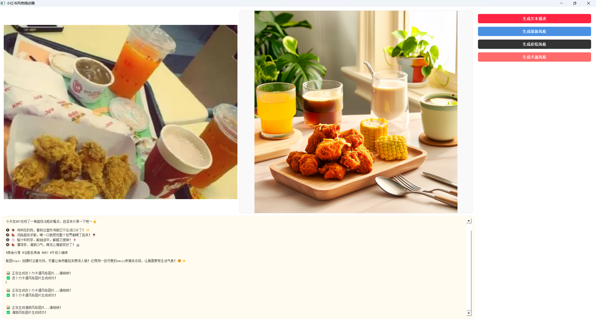

# Vision2RedNote

## Description

Vision2RedNote is an intelligent content creation system powered by Qwen-VL multimodal AI, designed to transform images into viral-style Rednote (Xiaohongshu) notes. This all-in-one solution helps creators generate engaging, emoji-rich social content with high interaction potential. (华中科技大学人工智能与自动化学院课程：视觉与自然语言处理大作业)



## Installation

### Prerequisites

- Python 3.8+
- PyTorch 2.0+
- CUDA (optional, for GPU acceleration)
- DashScope API key (for Qwen-VL model access)

### Setup

1. Clone the repository:

```bash
git clone https://github.com/yediong/Vision2RedNote.git
cd Vision2RedNote
```

2. Install required dependencies:

```bash
pip install -r requirements.txt
```

3. Configure API key:

   - Obtain a DashScope API key from [Aliyun DashScope Console](https://bailian.console.aliyun.com)
   - Replace the default API key in `pipeline_qwen.py` or set as an environment variable:

   ```bash
   export DASHSCOPE_API_KEY="your_api_key_here"
   ```

## Usage

### 1. Data Preparation

Organize your images into the following directory structure:

```
data/
├── Train/       # Training images
└── Val/         # Validation images
```

### 2. Generate Image Descriptions

Run the Qwen-VL pipeline to generate initial descriptions for your dataset:

```bash
python pipeline_qwen.py
```

This will:

- Process images in `data/Train` and `data/Val` directories
- Skip already processed images
- Save results to `descriptions/qwen_vl_descriptions.json`
- Generate logs in `descriptions/pipeline.log`

### 3. Model Training

Fine-tune the model on your dataset:

```bash
python train.py
```

Key training features:

- Uses Xiaohongshu style enhancement for training data
- Implements proper loss calculation by masking non-assistant tokens
- Automatically validates image files and filters low-quality descriptions

### 4. Evaluation

Evaluate model performance with either quick or full evaluation:

#### Quick Evaluation

```bash
python evaluate.py --quick --samples 20
```

#### Full Evaluation

```bash
python evaluate.py --model_dir ./qwen2-finetuned0824_3
```

#### Custom Evaluation

```bash
python evaluate.py --model_dir ./your_model_dir --json_path ./your_data.json --quick
```

Evaluation metrics include:

- Emoji density (average number of emojis per description)
- Xiaohongshu style score
- Visual comparison of generated vs. reference descriptions

### 5. Inference

Generate descriptions for new images using the trained model:

```bash
python inference.py
```

### 6. Visualization

Visualize the results and performance metrics:

```bash
python visualize.py
```

### 7. Run UI Interface 

Use our UI interface to run encapsulated interactive programs:

```shell
python New_demo.py
```

## Project Structure

```
Vision2RedNote/
├── data/                  # Image datasets
│   ├── Train/
│   └── Val/
├── descriptions/          # Generated descriptions and logs
├── pipeline_qwen.py       # Qwen-VL pipeline for initial description generation
├── train.py               # Model training script
├── evaluate.py            # Evaluation script
├── inference.py           # Inference script
├── visualize.py           # Visualization tool
├── New_demo.py            # UI interface
├── requirements.txt       # Project dependencies
└── README.md              # Project documentation
```

## Key Components

### QwenVLPipeline (pipeline_qwen.py)

- Handles image processing and description generation using Qwen-VL API
- Implements incremental processing to avoid redundant work
- Generates structured outputs with titles, hashtags, and key details
- Includes retry mechanism for API calls

### Training Module (train.py)

- `QwenVLDataset` class for data loading and preprocessing
- `_enhance_xiaohongshu_style` method for style optimization
- Custom loss calculation by masking non-assistant tokens
- Data validation and filtering

### Evaluation Module (evaluate.py)

- Supports both quick and full evaluation modes
- Calculates emoji density and style scores
- Provides sample comparisons between generated and reference descriptions
- Optimized for memory efficiency

## Customization Options

### Style Enhancement

Modify the `_enhance_xiaohongshu_style` method in `train.py` to:

- Add new emojis to the emoji libraries
- Update style replacement vocabulary
- Adjust emoji placement probabilities

### Generation Parameters

Tweak generation parameters in `inference.py` and `pipeline_qwen.py`:

- `temperature`: Controls randomness (0-1)
- `max_new_tokens`: Controls output length
- `top_p` and `top_k`: Control sampling strategy
- `repetition_penalty`: Reduces repetitive content

## License

[MIT License](LICENSE)

## Acknowledgments

- Based on Qwen-VL model by Alibaba DAMO Academy
- Developed as part of the "Vision and Natural Language Processing" course at Huazhong University of Science and Technology
- Thanks to all contributors and course instructors

## Contact

For questions and feedback, please contact: [yetinghong@hust.edu.cn]
